```{r setup, include=FALSE}
knitr::opts_chunk$set(echo = FALSE)
```

<!-- 
Character counts: 

- Title: 101 / 150
- Brief project description: 1996 / 2000
- Lay project description: 919 / 1000
- Project description: ~29,500 / 30,000
- Literature references: / 4000

Figure counts:

- 3 / 4
-->


# Lay description

Many initiatives in clinical research, including the Danish Centre for
Strategic Research in Type 2 Diabetes (DD2) initiative, have a hard time
getting funds for building and maintaining needed software that make sure
health science is the highest quality it can be. For this project, we aim to
build software tools that make it easier to do better research, especially for
managing and working with data. We'll first be building these tools to help
support the DD2 initiative.

We will be sharing these tools widely and freely, so that as many research
groups as possible can use it for their own projects. Not only will we build
these tools to help researchers with managing and sharing their data, we also
will create them with beginner-friendly documentation and training material to
make sure more researchers use our tools, no matter their skill level. We
believe that with these tools, science on health and well-being can become
better, ultimately helping people with diabetes and society in general.

<!-- 
Interested in reading about this more? Check out [our 
website](https://steno-aarhus.github.io/dif-project/) with a more detailed
description of our project. 
-->

# Summary

In clinical and health research, especially for small- to mid-sized research
groups, funding for building modern, open source software infrastructures for
managing and using data has been limited. This gap has naturally led to
organizational challenges for managing existing and incoming data for many
research initiatives, including the Danish Centre for Strategic Research in
Type 2 Diabetes (DD2) initiative, a national research collaboration and
database initiative established in 2010 with continual enrollment of persons
with type 2 diabetes. The aim of our project is to close this gap by creating
and implementing an efficient, scalable, and open source data infrastructure
framework that connects data collectors, researchers, clinicians, and other
stakeholders, with the data, documentation, and findings within the DD2 study.
This will improve and extend the existing DD2 research infrastructure into an
open national state-of-the-art research infrastructure that will provide easy
and transparent access to this resource for researchers, clinicians and
stakeholders, thus enabling excellent data science driven research.
Furthermore, we will create this framework in such a way that other research
groups and companies, who are unable to adequately invest in building
infrastructures of this type, can relatively easily implement it, and modify as
needed, for their own purposes. By building this framework, we have the
potential to help propel research groups and companies across Denmark (and
globally) to quickly getting updated on modern, scalable, and efficient
approaches to working with data. Within the DD2 setting, an open, transparent,
and easy access to this constantly growing resource has the potential of
greatly improving the interest in, use of, and scientific impact of this
resource, thus leading to substantial scientific and medical advancements,
individualised treatment and improved human health in not only persons with
type 2 diabetes, but population overall.

# Background

In clinical research, software and data infrastructure development is
undervalued and, aside from this funding call, underfunded, particularly for
small- to mid-sized research organizations. Clinical and health researchers
largely lack formal training, support, and awareness in research software
engineering (RSE) and in building and managing data infrastructures. The result
is that the overall software and computational ecosystem, as well as the
technical capacities to maintain them, lags behind multiple other scientific
domains (e.g., bioinformatics). Particularly with the recent rise of data
science and the greater focus on analytical reproducibility, this issue has
become increasingly apparent as data, and the skills required to work with it,
become ever larger, more technical, and complex. Indeed, investing in and
implementing scalable and modern data infrastructures and RSE processes, built
on open source software, have the potential to greatly improve the quality of
science, to produce more transparent and streamlined workflows, to lead to
reproducible research, and generally better science in less time
[@Lowndes2017].

Funding for participant recruitment and data acquisition has historically been
(and still is) easier to obtain than for building open source software and
infrastructures that support and enhance science, particularly for managing and
using data. This imbalance has naturally led to organizational challenges for
managing existing and incoming data for many research initiatives within the
field of clinical research, including for the Danish Centre for Strategic
Research in Type 2 Diabetes (DD2) initiative
[@Nielsen2012;@DD2].

DD2 is a national type 2 diabetes (T2D) research collaboration and database
initiative that was established in 2010, with on-going enrollment by hospital
physicians and general practitioners (GPs). Although T2D is a single diagnosis,
it comprises several phenotypes with diverse prognoses and risks for
complications, which can lead to treatments tailored to each phenotype. The
overarching aim of DD2 is to improve and individualise the treatment of persons
with T2D. Figure 1 shows the several datasets within DD2
[@Jakobsen2021;@Gylfadottir2020;@Stidsen2017;@Valentiner2019]. DD2 has received extensive
funding from the Danish Council for Strategic Research and the Novo Nordisk
Foundation as well as a Steno National Collaborative Grant for deep
phenotyping. Continuously recruiting more participants, adding new data, and
expanding the data access to researchers throughout Denmark and abroad has the
potential to further increase the value of DD2. However, this comes with higher
costs and resources for maintaining, extending, and improving on the existing
DD2 research infrastructure.


Building modern data infrastructures has slowly been taking greater priority by
funding and research agencies globally. For instance, the UK Biobank
[@Sudlow2015;@UKBiobank] is a large-scale biomedical
database with highly detailed data on ~500,000 participants. It is regularly
expanded with additional data and is globally accessible to approved
researchers and is a role model to building a modern research infrastructure.

While the UK Biobank is a source of inspiration on the state-of-the-art, the
underlying infrastructure itself is not openly accessible and reusable. The
same applies to a similar Danish initiative, the "_Single path to access Danish
health data_" project [@sundhedsdata], where
the Danish government and individual regions are collaborating to map out all
Danish health data. Another state-of-the-art initiative led by the University
of Chicago, USA is Gen3 [@gen3],
which contains modular open source services that can form the basis for a data
infrastructure [@ctds;@gen3software] and powers
several research platforms, including the National Institutes of Health
[@gen3platform]. However, we are unaware of
any similar current national efforts that are open source, re-usable, and
suitable for the Danish and EU legal context.

Our primary aim is to create and implement an efficient, scalable, and open
source data infrastructure _framework_ that connects data collectors,
researchers, clinicians, and other stakeholders, with the data, documentation,
and findings within the DD2 study. This will improve and extend the existing
DD2 into an open national state-of-the-art research infrastructure that will
provide easy and transparent access to this resource for researchers, thus
enabling excellent data science driven research. Our secondary aim is to create
this framework in such a way so that other research groups and companies, who
are unable to adequately invest in building similar infrastructures, can
relatively easily implement it and modify as needed for their own purposes.

# Methods

Our first steps are to build a data infrastructure framework and the second
step is to implement it in DD2. The details of the framework itself are
described first and later we describe how we will apply it to DD2.

## Overview of the data infrastructure framework

For this project, the data infrastructure _framework_ is defined as 1) a set of
software programs, 2) a defined and fixed set of conventions on the structure
and format of the filesystem and URL paths, and 3) a defined structure to the
data and associated documentation, all of which are linked together as modular
components. The framework will serve as an open source starting template for
setting up data infrastructures that make use of modern tools and processes.

This framework encompasses four target users and three layers, with a complete
schematic shown in Figure 2. The three layers are the web portal frontend, the
database and documentation backend, and the API (Application Programming
Interface) that interacts with both. The four users and their associated use
cases are:

1. **User 1**: Those _inputting data_, e.g., authorized centers and
researchers. The use cases are:
    1. Authorized centers (GPs and hospitals) upload standardized and routine data through the data entry web portal.
    2. Authorized researchers upload generated data from completed projects. Non-standardized data is manually processed and cleaned before entering into the database.
2. **User 2**: Those _requesting access_, e.g., researchers and clinicians. Use
cases are:
    1. Interested researchers browse the catalogue of available data and the data dictionary.
    2. Researchers request access to data by submitting a description of their proposed project and selecting the relevant data from the catalogue. This request is sent to a list of projects to await approval from the data controllers (User 4).
3. **User 3**: Those _viewing updates on findings and results_ such as
aggregate statistics, e.g., policymakers, healthcare workers, journalists,
researchers, and the general public. Use cases are:
    1. Users view and read through the list of completed, ongoing, and proposed projects that use the database.
    2. Users access and view aggregate statistics and the latest published findings that are relevant to them/their practice.
4. **User 4**: Administrators and data controllers. Use cases are:
    1. Approve newly submitted projects that request data and manage existing projects.
    2. Approve and authorize researchers to access the web portal for data requests and to manage current authorized researchers.
    3. Manage collection centers’ access and authorization.

Throughout this application, we’ll refer to these four users and three layers
as we expand on and describe the framework.


### Key principles underlying the framework

To ensure the development of this framework is efficient and focused, it will
adhere to key principles that are supported by strong philosophical and
scientific rationale:

1. Follow FAIR (Findable, Accessible, Interoperable, and Reusable), open, and
transparent principles for the framework itself and to enable FAIR principles
in the database. 
2. Be openly licensed and re-usable to facilitate uptake in other national
groups (or companies) who are unable to invest in and build it.
3. Uses state-of-the-art principles and tools in software design and
development.
4. Be beginner-friendly and targeted to (potential) non-computationally
technical users of the framework.

In order to maximise the potential for re-use and to minimise the technical
debt and expertise needed to use, maintain, and modify the framework, we will
use software and tools underlying the framework that fit these principles:

1. Wherever possible, re-use existing material: There already exists many great
software tools, infrastructures, and resources that haven’t been incorporated
into common health research practice. We will make use of and/or modify these
materials where we can.
2. Be familiar to or used by researchers currently or within the near future: To
ensure the greatest potential for continued maintenance, development, and use,
the framework should use or be built with tools and skills that are at least
familiar or soon to be familiar to researchers.
3. Be familiar to skilled personnel (e.g. research software engineers, data
engineers, data scientists): Skilled personnel will build this framework and
need to be familiar with them.
4. Be open source: Software that isn’t open source is by definition not
transparent, FAIR, or open. This is a requirement as it will encourage wide and
easy re-use.
5. Integrates easily with other software: Modular software that follows common
input/output conventions and has well-designed and documented APIs are easier to
build with and maintain.
6. Historically stable and reliable: While there are always new software being
built, maintenance and development is easier when using those that are
established.
7. Likely to be used in the future or is easily interchangeable with potential
future tools: Technology progresses quite quickly, so we will rely on software
that is likely to still be used or can be switched to other tools.

### Selected software and tools to use

Based on the above principles, we have chosen the following software and
conventions to form the framework’s foundation:

- **R and/or Python:** Are open source and established.
- **RESTful API:** REST (representational state transfer) is the de facto standard for building APIs.
- **CSV, SQL, and JSON format for data storage:** Are open source and established formats for data and other web information.
    - JSON (JavaScript Object Notation) is the Internet’s de facto standard format for information transfer.
    - CSV is well known to researchers.
    - SQL (a querying language and data storage format) is a widely used format for storing data.
- **Git, GitLab, and DVC for version control: **Formal version control (VC) systems are software that track changes to files and are standard practice software engineering. After Git was developed, it has increasingly been used by researchers across scientific fields to improve research transparency and openness. GitLab is an open source product to host Git projects and handles many modern software development tasks. DVC, or Data Version Control, is a machine learning VC software for data and models that integrates with Git.
- **Markdown for documentation:** Markdown is a common web format and is quickly becoming a standard in data science and even within many scientific fields. It is a simple syntax for writing documents that enables easy conversion to file formats like HTML or Word. It is simple and portable, so will be used for writing the data dictionary, results, documentation, and training material.
- **Tools for modern web-based interfaces:** These include HTML, CSS, JavaScript, and other web technologies, as well as User Interface (UI)/User Experience (UX) design principles.
- **Software development best practices: **This includes unit testing, continuous integration, and document-driven development (to emphasize usability). We’ll use the concept of Minimum Viable Product (MVP) as a means of quickly building something that is minimally workable.
- **Re-use of similar infrastructures:** Modules from initiatives like Gen3 will either be re-used directly or modified to fit our requirements.

## The framework’s layers

### Frontend interface: The web portal

This interface is what all users interact with and use, with essentially three
“permission” levels available:

1. Full access: User 4. 
2. Authorized access:
    1. User 1: A data upload portal that accepts either the routine, known data or new, unknown data from User 2.
    2. User 2: A data request portal that allows the user to select variables in the catalogue of data as well as write and submit project proposals for access.
3. Public access: User 3 would have access to all public pages, which includes
the data dictionary, updates on findings, list of current and past projects,
and a log of any changes or additions to the data.

All content would be rendered directly as plain HTML text to ease use of
existing webpage translation services (e.g. Google Translate), so that content
written in another language, i.e., Danish, would still be readable to
non-native speakers. This would also lower the amount of maintenance necessary
for documentation.

### Middle-layer: The API

Modern web and computational infrastructures are built on web APIs. Any modern
online resource or interface makes use of an API, such as from Google, Gen3, or
the UK Biobank. An API is a mechanism by which different programs can
communicate with one another. They form a set of instructions or conventions
that allow easy communication between a user and the computer. APIs by their
nature are transparent and if well-documented would ensure the linked data
would be FAIR, safely and securely.

In this case, the API would be between the user and the web server that stores
the underlying database and documentation. The API would be a combination of a
predefined set of instructions that are sent to the web server to run certain
commands as well as a set of explicit conventions and rules on how files and
folders are structured and named. Taken together, this API would allow other
software like R packages to be built to interact with the backend to automate
tasks done by the users.

### Backend: The database and documentation

Given the heterogeneity in the sources of data input, the backend will need to
be composed of multiple components: raw data files as plain text, cleaning and
processing programming scripts, a formal database structure (e.g. SQL), a VC
system to track changes to the raw data and processing scripts, a data version
numbering system, a changelog describing the changes, and a data dictionary
linked to the variables contained in the database. Versioning of the raw data
and scripts is done for recordkeeping, auditing, and transparency, in addition
to allowing comparison of data used between past and current projects that use
the data.

A major challenge to building the backend is in the heterogeneity of the data
input. The key is to establish and enforce a standardized Common Data Model
(CDM) for all incoming data at the point of entry. For the framework, the exact
contents of the database aren’t important, since as long as the contents follow
the CDM it will be programmatically merged into the final formal database. This
is necessary as the database contents depend heavily on the research topic and
aims of the study that will use this framework.

The backend documentation is either largely generated automatically or manually
written. For instance, the list of projects and findings would be generated by
the submitted projects and input from User 2 (researchers) while the changelog
would be updated either by automated additions or, optionally, manually from
User 4. The data dictionary would be stored as a JSON file with the
documentation text itself as Markdown text. This data dictionary would be
publicly accessible and could be updated by anyone (with approval from User 4),
potentially through “Merge Request” mechanisms. This mechanism involves
automatically linking any addition or correction back to the main documentation
and requesting it be merged into it.

## User-to-backend pipeline

### User 1: Inputting data

Depending on the source of data, there may already be established data input
processes. Substantial amounts of biomedical data, especially in Denmark, come
from already established, routinely collected clinical data such as from
outpatient clinics. For these sources of data, the data input pipeline would
involve redirecting these data sources through the API and storage format so
the data continues on to the backend.

Sources of data that don’t have well-established data input processes, such as
from hospitals, medical laboratories, and so on, would use the data input
portal. This portal would only accept data that is in a pre-defined format and
would include documentation, and potentially automation scripts, on how to
pre-process the data prior to uploading it.

Once the data is submitted through the portal, it would get sent in an
encrypted, legally-compliant format to the server and stored in the way defined
by the API and CDM. Any new or updated data that is uploaded would trigger
generic automated data cleaning, processing, quality control checks of this new
data. Any automated processing that is developed specific to a project would
need to adhere to the API’s conventions. If any issues are found or if the data
is entirely new to the database, they get sent to a log and User 4 would
receive a notification to deal with the issue. If there are no issues or the
issues have been dealt with, an automated script would take a snapshot of the
data with the VC system, the version number (based on [Semantic
Versioning](https://semver.org/)) of the data would be updated, an entry would
get added to the changelog, and the formal database would get updated.

### User 2: Requesting access

Researchers and other users who want to request access to the data would first
need their identity verified and then be approved for authorized access. After
approval, they would interact with the frontend by two routes:

1. Browsing from the catalogue of existing variables in the database, along
with the data dictionary and the data changelog, and then selecting those
variables that are relevant to their project. The catalogue of variables would
be a table that is built from the underlying set of files that contain the
documentation and that includes a button to select and save the variables of
interest. If they desired, they could also update any errors or types in the
data dictionary through the “Merge Request” mechanism described above.
2. Writing a description of the scientific rationale of the project and adding
any relevant information into a web form that User 4 would use to decide on
approval and that would be displayed on the website for User 3.

When User 4 approves a data request project, it will trigger an API request
that would automatically extract the requested subset of data, bundle and
encrypt it, and send it to the researcher’s secure server. The framework will
contain sufficiently generic methods for automating the data transfer process.

### User 3: Viewing details

The framework assumes that this user would interact with the portal through at
least three routes:

1. Reading about the database, its history, organizational structure and
ownership, and any other details in a typical “About” section. Since this is a
part of a basic website layout, it is not fully part of the framework. 
2. Browsing completed and ongoing projects making use of the database, along
with the description of the project and variables used. This would be based on a
“database” of projects that have requested access to the data, would be stored
in JSON format, and through the API specification would be generated into a
table on the portal. 
3. Getting updates on the latest results from the projects and browsing some
basic aggregate statistics of some key variables. This would involve
programmatically generating standard aggregate statistics of the underlying
database, formatting results according to the API, transferring them to the web
server, and have it generated into a webpage format. Overlapping with the second
route, key findings from completed projects can be stored in the projects
database and be generated into a listing on the website.

### User 4: Administrators and data controllers

These users would largely interact with the web portal for managing and
overseeing ongoing projects, approve access for new researchers, and approve
projects requesting access to data. Approving new researchers would grant the
researchers access permissions to enter the User 2 portal.

## Additional key components

### Security, privacy, and legality

The framework itself does not contain any personal data. When the framework is
deployed as an infrastructure for a database, only aggregate statistics, and
not individual-level personal data, would be publicly accessible. Any personal
data would be stored on a secure server that is decided and controlled by User
4, who would be responsible for complying with relevant legal requirements.

For data transfers of personal data, either from data collection centers, data
generated from researchers, or when transferring data for approved projects, we
would use well-established and compliant encrypted data transfer processes. Key
authentication principles such as two-factor authentication and OAuth (open
standard for access authentication) will be central to the framework to control
who can update or transfer the data. The endpoint of the data transfer is dealt
with by the legal teams of the relevant institutions.

### Dissemination of framework

To be aligned to the goals of openness, transparency, and FAIR principles, the
complete development of the framework will take place openly on GitHub. From
there we will link to and promote it through various outlets, including
publications, conferences, and social media. The framework and all its
components will be licensed under permissive copyright licenses like the MIT
License for the software and the Creative Commons Attribution License for
non-software content.

### Sustainability

Integral to this framework is ensuring it is sustainable over the long-term by:

1. Integrating the development of the framework and using it in multiple
projects at the host institution Steno Diabetes Center Aarhus (SDCA). 
2. Prototyping MVP to build and document maintenance procedures.
3. Incorporating fundamental open source sustainability concepts and
documentation such as writing a Code of Conduct and Contributing Guidelines and
encouraging external users to contribute. 
4. Including duties for the hired personnel to contribute back to open source
software that the framework depends on to help their, and indirectly the
framework’s, sustainability.

### Training and educational development

Usage of this framework depends on the quality of its documentation and
training material. A key concept we will use heavily is Documentation Driven
Development, where the framework’s development is guided and informed from the
development of the documentation, which places documentation as a high
priority. We will also be creating and running short workshops and tutorials
that teach researchers how they can use this framework.

## Resource requirements

### Computational and physical infrastructure

While the proposed framework is software-based, storing and deploying the
infrastructure requires server space and IT support. The framework itself takes
up little space and can optimise computational resources, but the underlying
DD2 data requires considerable server space.

### Technical skills and personnel

To have a meaningful impact on improving research infrastructure, the minimum
skills and knowledge necessary are:

- Building and interacting with RESTful APIs (or APIs in general)
- Creating websites and knowledge on UI/UX designs
- Developing software/general programming in R/Python
- Using Git and GitHub/GitLab
- Database management/administration
- Familiar with creating training material and teaching
- Experience in working on open source projects and with FAIR principles
- Experience in the Danish research computing environments, e.g., "forskermaskine" (research engine on Denmark Statistics (DST))

## Applying the framework to DD2

The biggest potential challenge to applying the framework to DD2 is getting the
database backend into the appropriate structure to fit within the framework.
With the current state of the DD2 data, considerable time and effort is needed
to organize it. Our initial steps will be to:

1. _Survey and map out all data, documentation, and processing steps_.
Currently, the original enrollment data are stored in a secure server at the
DD2 headquarters at Odense, while subsets of data collected for specific
research projects are spread across several research institutions. 
2. _Map the data input sources and formats from the various collection centers_.
GP clinics have an existing pipeline for sending data to DD2 through their
system, “sundhedsdatanettet” (national healthcare portal), following a patient
visit. Other collection centers like hospitals have custom, but not
standardized, approaches to sending data to DD2. No formal approach is available
for returning data from completed projects. The core DD2 data is sent to
“forskermaskine” and gets merged there with the registry data, which is in a
standard DST format.  
3. _Move as much data as possible to a central location_. All data will be
stored at the DD2 headquarters in Odense, except large-scale data that will be
either stored or transferred as needed to a high-performance computing (HPC)
platform. For linkage with registry data, we will acquire a dedicated DD2 "forskermaskine" server.
4. _Re-structure current data into the framework’s CDM_. 
5. _Build software to automate the cleaning, processing, and merging of the
existing and established data input pipelines into the framework’s required
backend format_.
6. _Establish automated processes for linkages between the data storage servers_.
7. _Implement framework’s remaining modules, starting with User 4 and then
moving from User 1 to 3, in that order_.

Currently, User 3 can request data by filling out a Word [application
form](https://dd2.dk/media/1410/standard-dd2-protocol_final.doc) and emailing
it to the chair of the advisory board Kurt Højlund and programme leader Jens
Steen Nielsen. Applications are reviewed by the steering committee and, once
approved, the data manager at the Department of Clinical Epidemiology (KEA) in
Aarhus University Hospital then manually extracts the requested data and
transfers the data subset to the applicant’s secure server and does this for
each individual research project. If requested, KEA may also perform analyses
on the data. Researchers must already have valid authorized access to the
secure servers on an existing "forskermaskine" or an [HPC
facility](https://www.deic.dk/en/supercomputing/national-hpc-facilities) for
the large-scale data, such as [Computerome 2](https://www.computerome.dk/) and
[GenomeDK](https://genome.au.dk/).

The costs of storing the original data are covered by DD2, while applicants
cover the costs related to storing the transferred data. We will not charge for
data access. As per legal requirements, researchers can only use the data for
the intended purposes listed in the application. After project completion, the
researchers must delete or close access to the data and inform DD2 as legally
required. Any newly generated data must be returned to DD2 by uploading via the
User 1 portal.

## Deliverables and milestones

Because the framework will be built with modularity in mind, where each
component could be used alone or together, nearly all the components could be
deliverables (each User by each layer). Each deliverable would be to prototype
a MVP to begin testing it, identifying bugs, getting feedback, and establishing
maintenance procedures. See Figure 3 for the Gantt chart.



# Collaborations

The framework will be developed at SDCA with Professor Annelli Sandbæk
(applicant) as the lead PI responsible for reaching the overall goals of the
project and defined milestones, as well as two postdocs, Luke Johnston, MSc,
PhD and Alisa Kjærgaard, MD, PhD. A project group
headed by the PI will be established that includes central persons from SDCA
and DD2. In close collaboration with the project manager of DD2 and the current
data manager, the deliverables will be planned and carried through. Completing
the proposed project requires hiring data and research software engineer
personnel into the project, which will be the first step in the project
process. The DD2 advisory group will also act as the advisory group for this
project. This group is chaired by Kurt Højlund, MD, PhD, head of research at
Steno Diabetes Center Odense and contains representatives from affiliated
research projects and other DD2 stakeholders.

# Significance

We are at a key point in time within clinical research where it is increasingly
being recognized that open source software and computational infrastructure are
critical and necessary components to ensuring science is high-quality,
reproducible, rigorous, and transparent. Funding agencies and research
institutions globally are putting greater efforts into modernizing many of
their infrastructures using the many software technologies that have risen in
the last decade. By building this framework, we have the potential to help
propel research groups and companies across Denmark (and globally) to quickly
getting updated on modern, scalable, and efficient approaches to working with
data.

Within the DD2 setting, an open, transparent, and easy access to this
constantly growing resource has the potential of greatly improving the interest
in, use of, and scientific impact of this resource. Incorporating new data
generated from the DD2 resource back into DD2 will enable other researchers to
test or use this data to advance their own work. This would lead to substantial
scientific and medical advancements, which will ultimately lead to
individualised treatment and improved human health in individuals with type 2
diabetes, and very likely the population overall.
