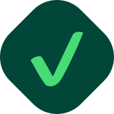
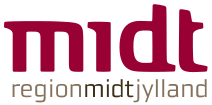

::::: landing-page-block
:::: hero-text
::: text-center
{fig-alt="Seedcase logo."
width="150px"}

{fig-alt="Seedcase font."
width="250px"}

# An open ecosystem for growing FAIR and tidy data

::: {style="margin-top: 50px;"}
[Explore our roadmap](/roadmap/index.qmd){.btn-primary .btn}
:::

:::
::::
:::::

::::: hero-banner
:::: landing-page-block
::: hero-text

## What we do

We develop open-source tools for research teams who need to collect,
manage, and share data in a consistent and FAIR (Findable, Accessible,
Interoperable, and Reusable) way.

:::: {layout="[33, 33, 33]"}
::: landing-page-card
{fig-alt="Sprout logo."
width="50px"}

{fig-alt="Sprout font."
height="22px"}

Grow organised and FAIR data

[Learn more](https://sprout.seedcase-project.org/){.about-link .btn .stretched-link}
:::

::: landing-page-card
{fig-alt="Check Datapackage logo."
width="50px"}

{fig-alt="Check Datapackage font."
height="30px"}

Ensure the compliance of your Data Package metadata

[Learn more](https://check-datapackage.seedcase-project.org/){.about-link .btn .stretched-link}
:::

::: landing-page-card
{fig-alt="Flower logo."
width="50px"}

{fig-alt="Flower font."
height="19px"}

Turn your metadata into human-readable documentation

[Learn more](https://flower.seedcase-project.org/){.about-link .btn .stretched-link}
:::
::::

:::
::::
:::::

:::: landing-page-block
::: hero-text

## A value-based and principle-driven initiative

In the **Seedcase Project**, we build software and community together. We're
dedicated to **open science** and **open source**, and we incorporate
this in all aspects of our work. Our values and principles
are described on our [design](https://design.seedcase-project.org/)
website, and we write posts about our work and learnings on our
[community](https://community.seedcase-project.org/) website.

We aim to:

- Help research groups and institutions create and manage high-quality and
FAIR (Findable, Accessible, Interoperable, and Reusable) research
data.
- Enable individual researchers to find and (re-)use data more easily for
their own research.
- Reduce the time from data generation to scientific dissemination by
focusing on streamlining and automating the data ingestion,
processing, storage, and management processes.

[Read more about the project](/about/index.qmd){.about-link .btn}
:::
::::

::::: hero-banner
:::: landing-page-block
::: hero-text
## Goals

### []{style="color: #48DC76"} Develop open-source software for health data

Software that is open-source and targeted to diverse users, like health
research organizations and small-to-medium sized companies.

### []{style="color: #48DC76"} Create beginner-friendly documentation

Software is nothing without documentation. We strive to create
documentation that is beginner-friendly, easy to understand, and as
accessible as possible.

### []{style="color: #48DC76"} Build an inclusive community

A community that is open and inclusive that shares knowledge, learnings,
and better practices in research data engineering and software
engineering.

### []{style="color: #48DC76"} Lead by example

By building this project as fully open as possible and applying the same
principles we teach and advocate for.
:::
::::
:::::

::::: landing-page-block

## Acknowledgements {#acknowledgements}

:::: {layout="[70, 30]"}
::: {#acknowledgements-left}
The Seedcase Project is funded by a grant from the [Novo Nordisk
Foundation](https://novonordiskfonden.dk/en/), number NNF21OC0069462.
See the application
[here](https://seedcase-project.org/about/history/nnf-application).
:::

::: {#acknowledgements-right}
{fig-alt="The Novo Nordisk Foundation logo"
width="200px" fig-align="right"}
:::
::::

:::: {layout="[30, 70]"}
::: {#employers-left}
{fig-alt="Aarhus University logo"
width="200px" fig-align="center"}
{fig-alt="Central Denmark Region logo"
width="140px" fig-align="center"}
:::

::: {#employers-right}
We are employed at [Aarhus University](https://www.au.dk/en/) and at the
[Steno Diabetes Center Aarhus](https://www.stenoaarhus.dk/) in the
[Central Denmark Region](https://www.rm.dk/).
:::
::::
:::::
